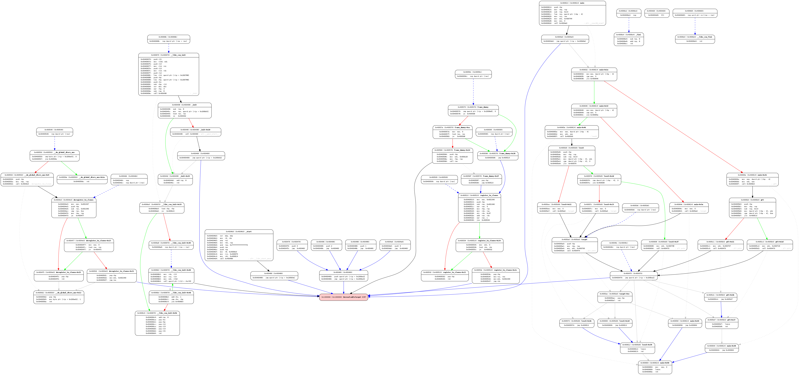
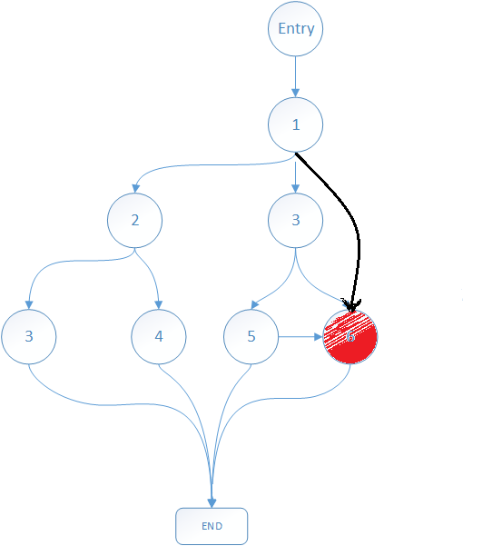
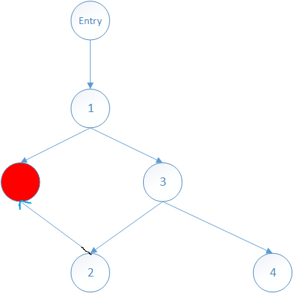

# Dircted Symbolic Execution 

### 汇报人：赵健
### 2013-11-10
---

## CFG
- angr的`explore`函数有一个`cfg`参数，它说给了`cfg`之后，一些不可达的节点会被avoid
> If an angr CFG is passed in as the "cfg" parameter and "find" is either a number or a list or a set, then any paths which cannot possibly reach a success state without going through a failure state will be preemptively avoided.

- 我去调研了一下，给`CFGFast Object`之后，得不到一条路径，只有一个`avoid`，`with 1 runs`
- 有些给了`CFGAccurate Object`只能找到一部分路径
- 单步跟踪`explore`并没有看懂它具体的意思，不知道他怎么把得到的结果传回去的
---
```python
		if cfg is not None:
            if isinstance(avoid, (int, long)):
                avoid = (avoid,)
            if not isinstance(avoid, (list, tuple)):
                avoid = ()
            if isinstance(find, (int, long)):
                find = (find,)
            if not isinstance(find, (list, tuple)):
                self.cfg = None
                return
            # not a queue but a stack... it's just a worklist!
            queue = sum((cfg.get_all_nodes(f) for f in find), [])
            while len(queue) > 0:
                n = queue.pop()
                if n.addr in self.ok_blocks:
                    continue
                if n.addr in avoid:
                    continue
                self.ok_blocks.add(n.addr)
                queue.extend(n.predecessors)
```

---

## CFG Create By angr
- [Angr CFG viewer 第三方](https://github.com/axt/angr-utils)


---

## 自己可以获取到那些avoid节点吗？
### Backward Excution
1. 利用`cfg.get_any_node(addr, anyaddr=True)`，找到地址所在的CFGNode
2. `node.predecssors`获取所有的父节点， `node.successors`获取所有子节点
3. 根据每一个父节点，父节点的其他分支全部avoid，因为暂时认为不可达
4. 依次向上执行，直到没有父节点，如果该节点不是入口点，那么avoid

---

## It works properly with this



---

## How about this


> 1. target: 父节点【1,2】
> 2. process 【1】： avoid => [3]
> 3. process 【2】： avoid => [3,4]
