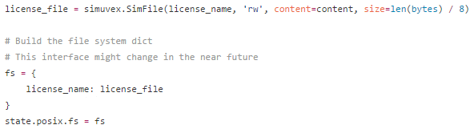

# 工作汇报
## 2016.11.11 -
## 赵健

***

# Angr符号化命令行参数
- [示例脚本](https://github.com/angr/angr-doc/blob/master/examples/strcpy_find/solve.py), [ctf示例脚本2](https://github.com/angr/angr-doc/blob/master/examples/securityfest_fairlight/solve.py)
- 解析xml文件，找出含有`argv`参数的每一个Result，然后找到其最后一个pathnode，获取漏洞所在位置
- **确定`argv`参数的个数，以及每个参数的类型**

***

## 文件的符号化
- 构造一个虚拟文件, [示例代码](https://github.com/angr/angr-doc/blob/master/examples/asisctffinals2015_license/solve.py)

- 解析xml文件，找出所有打开文件对应的Result，可能调用`open`，`fopen`,找到其最后一个pathnode，获取漏洞位置
- 是否需要虚拟文件内容
- 需要知道文件大小

***