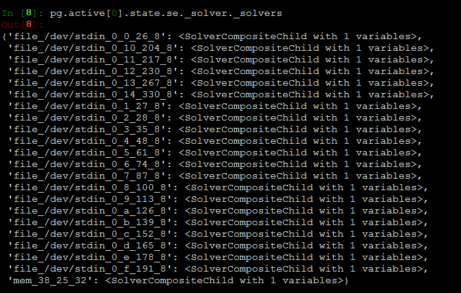
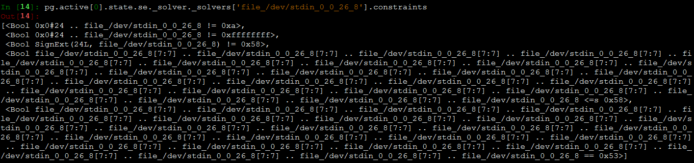

## _solver_list
- Class: `CompositeFrontend`
- File: `claripy\frontends\composite_frontend.py`

```python
@property
def _solver_list(self):
	seen_solvers = set()
    solver_list = [ ]
    for s in self._solvers.itervalues():
    	if id(s) in seen_solvers: continue
        seen_solvers.add(id(s))
        solver_list.append(s)
	return solver_list

@property
    def variables(self):
        if len(self._solver_list) == 0:
            return set()
        else:
            return set.union(*[s.variables for s in self._solver_list])
```
- `CompositeFrontend`继承自`ConstrainedFrontend`
- 初始化时，`_solver_list`中用到的`self._solvers`被设置为空，所以要找一下其他使用这个变量的地方
- `_ana_setstate`是除了初始化函数外唯一修改`self._solvers`的函数，继续跟踪一下
- 在`_solver_list`下断点，通过调试跟踪，发现第一次执行时是`Path.copy`函数里面的`Path`初始化调用，有一个`self.state.copy()`, File:`path.py`, line: `599`

```python
def copy(self, error=None):
    if error is None:
        p = Path(self._project, self.state.copy())
    else:
        p = ErroredPath(error, self._project, self.state.copy())
```
- `simuvex\plugins\solver.py`:456  会调用`add`函数，增加`_solver`变量，调试到这里感觉`_solver`里面存储的是**约束表达式**

```python
def add(self, *constraints):
	cc = self._adjust_constraint_list(constraints)
    return self._solver.add(cc)
```
- 看一下`_solvers`里面都是些什么， `file_/dev/stdin_0_0_26_8`这是在约束表达式里面才可以看到的，`_solvers_list`里面存的其实是后面的`<SolverCompositeChild with 1 variables>`, `SolverCompositeChild`：`claripy\solvers.py`

- 看一下`SolverCompositeChild`: 
- 所以我们可以断定`_solver_list`里面存的其实是**约束表达式**

PS: `if len(self._solver_list) == 0:`可以修改一下，只获取大小,没必要再构造一个`_solver_list`,功能是为了看`_solver`里面有多少个不一样的元素
```python
@property
    def variables(self):
        if len(self._solver_list) == 0:
            return set()
        else:
            return set.union(*[s.variables for s in self._solver_list])
```
