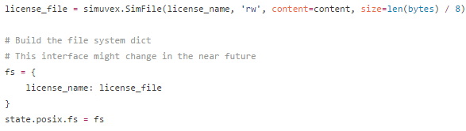

# Angr笔记
## 赵健

## 文件的符号化
- 构造一个虚拟文件, [示例代码](https://github.com/angr/angr-doc/blob/master/examples/asisctffinals2015_license/solve.py)

- 解析xml文件，找出所有打开文件对应的Result，可能调用`open`，`fopen`,找到其最后一个pathnode，获取漏洞位置
- 是否需要虚拟文件内容
- 需要知道文件大小

## 文件的符号化
- Angr会默认构造用到的文件，所以在`pg.found[0].state.posix.files`可以找到构造的文件名字与句柄
- 如果希望angr不构造文件内容，需要指定`concrete_fs=True`

## Angr的执行策略
- Director  **directed symbolic execution.**
符号化执行的过程中维护一个`CFGAccurate`, 当执行到的块不在当前维护的`CFGAccurate`片段中时，会继续对`CFGAccurate`做`recovery`.
 - `CallFuntionGoal`以到达某个函数为目标，可以指定函数的参数
 - `ExecuteAddressGoal`以到达某个地址为目标，必须是基本块首地址

- **Threading   多线程Z3求解**
This is only useful in paths where a lot of time is taken inside z3, doing constraint solving.
- **Veritesting**
通过smart merging解决state explosion

