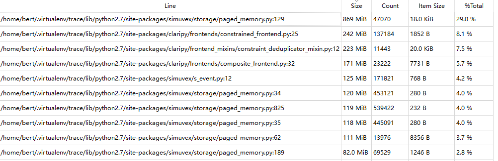

## tracemalloc数据分析
分析step 1000 used 12159168K，占用11.59G内存


1. `simuvex/storage/paged_memory.py` : 129, Class：Page
```python
128     def copy(self):
129         return Page(self._page_size, storage=dict(self._storage), 									permissions=self.permissions, sinkhole=self._sinkhole)
```
2. `claripy/frontends/constrained_frontend.py` : 25, Class: ConstrainedFrontend
```python
 23     def _copy(self, c):
 24         super(ConstrainedFrontend, self)._copy(c)
 25         c.constraints = list(self.constraints)
 26         c.variables = set(self.variables)
 27
 28         # finalize both
 29         self.finalize()
 30         c.finalize()
```

## 64G分析结果，前20名，按行号分
- 按文件分前十名

| File | Size | Count | Average |
|------|------|-------|---------|
| simuvex/storage/paged_memory.py | 7466 MiB | 8412246 | 930 B |
| claripy/frontends/constrained_frontend.py | 5175 MiB | 646941 | 8389 B |
| claripy/frontend_mixins/constraint_deduplicator_mixin.py | 4697 MiB | 75849 | 63.0 KiB |
| claripy/frontends/composite_frontend.py | 3630 MiB | 284664 | 13.0 KiB |
| angr/path_history.py | 1779 MiB | 1322558 | 1410 B |
| simuvex/s_event.py | 837 MiB | 1762377 | 498 B |
| angr/path.py | 226 MiB | 750573 | 316 B |
| simuvex/storage/memory.py | 204 MiB | 391427 | 547 B |
| archinfo/arch.py | 200 MiB | 161764 | 1299 B |
| simuvex/plugins/scratch.py | 174 MiB | 212966 | 858 B |